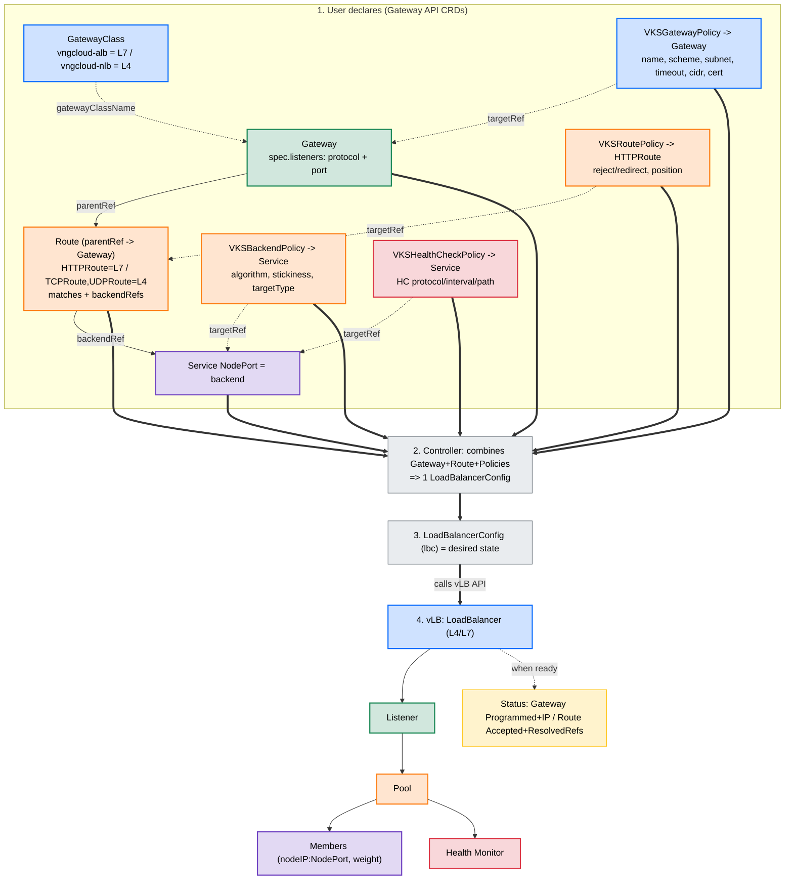

# Gateway API (ALB)

The controller implements the [Kubernetes Gateway API](https://gateway-api.sigs.k8s.io/) (v1) for VNGCloud **Application Load Balancers** (L7). It is the successor to the Ingress + annotations path: a `Gateway` + `HTTPRoute` pair produces the same `LoadBalancerConfig` the Ingress controller emits, so both paths drive identical cloud resources.



| | |
|---|---|
| GatewayClass | `vngcloud-alb` |
| Controller name | `gateway.vks.vngcloud.vn/alb` |
| Supported routes | `HTTPRoute` |
| Customisation | Four policy CRDs via [GEP-713 direct policy attachment](https://gateway-api.sigs.k8s.io/geps/gep-713/) |

!!! note "Phase 1 scope"
    Current support covers ALB (L7) with `HTTPRoute`. NLB (L4, `Gateway` + TCP/UDP routes), `GRPCRoute`, and `BackendTLSPolicy` are planned for later phases. L4 workloads keep using `Service` of type `LoadBalancer`.

## Enabling / disabling

The ALB Gateway controller is **disabled by default** so the chart installs cleanly on clusters that have not installed the Gateway API CRDs. Enable it only after those CRDs are present. The Helm chart installs the `vngcloud-alb` GatewayClass and wires the controller flag from one toggle:

```yaml
# values.yaml
gatewayApi:
  alb:
    enabled: true   # set true to enable the controller and install the GatewayClass
```

The underlying controller flag is `--disable-alb-gateway-controller` (default `true`).

!!! warning "Gateway API CRDs are a prerequisite"
    The cluster must have the [Gateway API standard CRDs](https://gateway-api.sigs.k8s.io/guides/#installing-gateway-api) installed (`Gateway`, `HTTPRoute`, `ReferenceGrant`, ...). The controller does not install them.

## Quick start

```yaml
apiVersion: gateway.networking.k8s.io/v1
kind: Gateway
metadata:
  name: my-gateway
  namespace: default
spec:
  gatewayClassName: vngcloud-alb
  listeners:
    - name: http
      protocol: HTTP
      port: 80
      allowedRoutes:
        namespaces:
          from: Same
---
apiVersion: gateway.networking.k8s.io/v1
kind: HTTPRoute
metadata:
  name: my-route
  namespace: default
spec:
  parentRefs:
    - name: my-gateway
  rules:
    - matches:
        - path: {type: PathPrefix, value: /}
      backendRefs:
        - name: my-service
          port: 80
```

The controller provisions an ALB, then reports readiness on the Gateway:

```bash
kubectl get gateway my-gateway
NAME         CLASS          ADDRESS         PROGRAMMED   AGE
my-gateway   vngcloud-alb   203.0.113.42    True         3m
```

Under the hood each Gateway owns one `LoadBalancerConfig` (see [LoadBalancerConfig CRD](load-balancer-config.md)); inspect it with `kubectl get lbc -l vks.vngcloud.vn/owner-resource-name=my-gateway`.

## HTTPRoute support matrix

| HTTPRoute feature | Supported | Translation |
|---|---|---|
| `path: Exact` | ✅ | L7 rule `PATH` / `EQUAL_TO` |
| `path: PathPrefix` | ✅ | L7 rule `PATH` / `STARTS_WITH` |
| `path: RegularExpression` | ✅ | L7 rule `PATH` / `REGEX` |
| `hostnames` | ✅ | L7 rule `HOST_NAME` |
| Weighted `backendRefs` | ✅ | One pool, member weights scaled to the ratio (`weight: 0` excludes the backend) |
| Cross-namespace `backendRefs` | ✅ | Requires a [`ReferenceGrant`](#cross-namespace-backends) |
| `RequestRedirect` filter | ✅ | Policy action `REDIRECT_TO_URL` |
| `headers` / `queryParams` / `method` matches | ❌ | Rule is dropped; the route reports `PartiallyInvalid` |
| Other filters (`URLRewrite`, `RequestHeaderModifier`, ...) | ❌ | Not expressible on the VNGCloud LB API |

## Policy CRDs (GEP-713)

LB-specific knobs that the Gateway API does not model are attached with four namespaced policy CRDs in group `gateway.vks.vngcloud.vn/v1alpha1`. Each policy selects its target with `targetRefs`:

| CRD | Targets | Configures |
|---|---|---|
| `VKSGatewayPolicy` | `Gateway` (optionally one listener via `sectionName`) | LB creation spec, listener timeouts, allowed CIDRs, inserted headers, certificates |
| `VKSBackendPolicy` | `Service` | Pool algorithm, stickiness, member target type, TLS to backend |
| `VKSHealthCheckPolicy` | `Service` | Health monitor of the pools fed by the Service |
| `VKSRoutePolicy` | `HTTPRoute` (optionally one rule via `sectionName` = rule `name`) | Rule action override (Reject / Redirect), rule position |

### VKSGatewayPolicy

```yaml
apiVersion: gateway.vks.vngcloud.vn/v1alpha1
kind: VKSGatewayPolicy
metadata:
  name: my-gateway-policy
  namespace: default
spec:
  targetRefs:
    - group: gateway.networking.k8s.io
      kind: Gateway
      name: my-gateway
      # sectionName: https   # optional: scope to one listener
  loadBalancerSpec:
    scheme: Internet                # Internet | Internal | InterVPC
    packageId: "lbp-..."            # LB package (size)
    loadBalancerName: my-custom-lb  # create-only; default = generated name
    subnetId: "sub-..."             # explicit subnet
    preferZoneId: "HCM03-1A"        # pin the LB to a zone (lower precedence than subnetId)
    loadBalancerId: "lb-..."        # adopt an existing LB instead of creating one
    privateSubnetId: "sub-..."      # InterVPC client subnet
    enableAutoscale: false
    isPOC: false
    tags: {team: platform}
  timeoutClient: 50s
  timeoutMember: 50s
  timeoutConnection: 5s
  allowedCidrs: ["0.0.0.0/0"]
  insertHeaders: {X-Forwarded-Proto: "true"}
  certificateIds: ["cert-..."]      # pre-imported VNGCloud certificate IDs
  clientCertificateId: "cert-..."   # mTLS client CA
```

An **unscoped** policy (no `sectionName`) applies to the whole Gateway and is the only place `loadBalancerSpec` is read. A policy scoped with `sectionName` overrides listener-level fields (timeouts, CIDRs, headers, certificates) for that listener only.

!!! warning "Create-only fields"
    `loadBalancerName`, `subnetId`, `preferZoneId`, and `loadBalancerId` are resolved **once, when the LB is first created**. Apply the `VKSGatewayPolicy` *before* the Gateway; changing these fields later has no effect on an existing LB. All other fields reconcile continuously.

**Subnet/zone precedence:** `loadBalancerId` (adopt — subnet/zone follow the existing LB) → `subnetId` → `preferZoneId` (a cluster node in that zone must exist) → cluster default. An unresolvable value (bogus LB ID, zone with no nodes) **fails closed**: no LB is created and the error is logged, rather than silently falling back to the default subnet.

**Bring your own LB:** set `loadBalancerSpec.loadBalancerId` to adopt an existing ALB. The controller then manages listeners/pools/policies on that LB instead of provisioning a new one. On Gateway deletion only controller-created resources are cleaned up — the LB itself is deleted only when *everything* on it was created by the controller; pre-existing listeners keep the LB alive.

### VKSBackendPolicy

```yaml
apiVersion: gateway.vks.vngcloud.vn/v1alpha1
kind: VKSBackendPolicy
metadata:
  name: my-backend-policy
  namespace: default
spec:
  targetRefs:
    - {group: "", kind: Service, name: my-service}
  targetType: instance            # instance (node IP + nodePort) | ip (pod IPs); default auto-detected from CNI
  poolAlgorithm: ROUND_ROBIN      # ROUND_ROBIN | LEAST_CONNECTIONS | SOURCE_IP
  stickiness: true
  enableTLSEncryption: false
  targetNodeLabels: {pool: edge}  # instance mode: only nodes matching these labels become members
```

### VKSHealthCheckPolicy

```yaml
apiVersion: gateway.vks.vngcloud.vn/v1alpha1
kind: VKSHealthCheckPolicy
metadata:
  name: my-healthcheck
  namespace: default
spec:
  targetRefs:
    - {group: "", kind: Service, name: my-service}
  protocol: HTTP                  # HTTP | HTTPS | TCP
  interval: 30s
  timeout: 5s
  healthyThreshold: 3
  unhealthyThreshold: 3
  port: 8081                      # probe port override; default = each member's traffic port
  httpHealthCheck:                # HTTP/HTTPS only
    path: /healthz
    host: app.example.com
    method: GET                   # GET | PUT | POST
    httpVersion: "1.1"            # "1.0" | "1.1"
    expectedCodes: ["200"]
```

!!! note "Weighted rules need consistent backend policies"
    When a rule has multiple `backendRefs`, they merge into **one** cloud pool, which can carry only one backend/health-check configuration. All backends of such a rule must resolve to the *same* `VKSBackendPolicy`/`VKSHealthCheckPolicy` objects (target both Services from one policy via multiple `targetRefs`). Divergent policies fail the rule closed and the route reports `ResolvedRefs: False` with reason `BackendConfigMismatch`.

### VKSRoutePolicy

```yaml
apiVersion: gateway.vks.vngcloud.vn/v1alpha1
kind: VKSRoutePolicy
metadata:
  name: block-admin
  namespace: default
spec:
  targetRefs:
    - group: gateway.networking.k8s.io
      kind: HTTPRoute
      name: my-route
      sectionName: admin          # the HTTPRoute rule's `name`
  position: 10                    # explicit L7 policy position on the listener
  actions:
    - type: Reject                # Reject | Redirect
      # redirect:
      #   url: https://moved.example.com
      #   httpCode: 302
      #   keepQueryString: true
```

Without a `VKSRoutePolicy`, a routed rule defaults to `REDIRECT_TO_POOL` (forward to its backend pool).

## Policy scope & multi-Gateway exposure

The four CRDs follow GEP-713 **direct policy attachment**: a policy's effect is bound to the single object its `targetRefs` names and must not leak beyond it. The attachment layer fixes the scope:

| Policy | Scope of effect |
|---|---|
| `VKSGatewayPolicy` | the LB / one listener |
| `VKSBackendPolicy`, `VKSHealthCheckPolicy` | a **Service** — i.e. *every* pool fed by that Service, on *every* Gateway that routes to it |
| `VKSRoutePolicy` | a route / one rule |

The consequence to internalise: **backend configuration attaches to the Service, so it is global to that Service.** This mirrors upstream [`BackendTLSPolicy`](https://gateway-api.sigs.k8s.io/geps/gep-1897/) (GEP-1897), which configures the backend connection *"when [the Service] is used as a backend by a Route"* — for **all** such routes. Gateway API deliberately has no per-route / per-Gateway backend policy, and [GEP-713](https://gateway-api.sigs.k8s.io/geps/gep-713/) tells implementations **not** to key policy off a `backendRef` (it is not unique across a route's rules and is a link to another object). The only standardised sub-scope on a Service is its **port** (`sectionName`), which these CRDs do not yet use.

### Expose one app through an external **and** internal Gateway

Two Gateways — one `Internet`, one `Internal` — with the route attached to both. The scheme is per-Gateway, so it lives on two `VKSGatewayPolicy` objects:

```yaml
# one HTTPRoute (NLB: TCPRoute/UDPRoute) attached to both Gateways
parentRefs: [{name: gw-ext}, {name: gw-int}]
# ... rules / backendRefs ...
---
apiVersion: gateway.vks.vngcloud.vn/v1alpha1
kind: VKSGatewayPolicy
metadata: {name: ext, namespace: demo}
spec:
  targetRefs: [{group: gateway.networking.k8s.io, kind: Gateway, name: gw-ext}]
  loadBalancerSpec: {scheme: Internet}
---
apiVersion: gateway.vks.vngcloud.vn/v1alpha1
kind: VKSGatewayPolicy
metadata: {name: int, namespace: demo}
spec:
  targetRefs: [{group: gateway.networking.k8s.io, kind: Gateway, name: gw-int}]
  loadBalancerSpec: {scheme: Internal}
```

If both LBs want the **same** backend behaviour, a single Service + a single `VKSBackendPolicy` serves both.

### Different backend behaviour per Gateway → different Service

Because backend policy is service-global, you **cannot** give one Service a different `targetType` (or algorithm, stickiness, …) per Gateway. When two frontends genuinely need different backend behaviour, that is two backend *intents* — model it as **two Services with the same pod selector**, each with its own `VKSBackendPolicy`:

```yaml
apiVersion: v1
kind: Service
metadata: {name: app-ext, namespace: demo}
spec: {type: NodePort, selector: {app: myapp}, ports: [{port: 80, targetPort: 80}]}
---
apiVersion: v1
kind: Service
metadata: {name: app-int, namespace: demo}
spec: {type: ClusterIP, selector: {app: myapp}, ports: [{port: 80, targetPort: 80}]}
---
apiVersion: gateway.vks.vngcloud.vn/v1alpha1
kind: VKSBackendPolicy
metadata: {name: ext-instance, namespace: demo}
spec: {targetRefs: [{group: "", kind: Service, name: app-ext}], targetType: instance}
---
apiVersion: gateway.vks.vngcloud.vn/v1alpha1
kind: VKSBackendPolicy
metadata: {name: int-ip, namespace: demo}
spec: {targetRefs: [{group: "", kind: Service, name: app-int}], targetType: ip}
```

`gw-ext`'s route targets `app-ext`; `gw-int`'s targets `app-int`. This is the Gateway-API-idiomatic answer, not a workaround — "different backend behaviour" is expressed as "different backend object", consistent with direct policy attachment.

## Conflict resolution & policy status

When several policies of the same kind target the same object, the **oldest** (by `creationTimestamp`, then alphabetical) wins — per GEP-713. Every policy reports its outcome in `status`:

| `Accepted` condition | Meaning |
|---|---|
| `True` / `Accepted` | Policy is attached and applied |
| `False` / `Conflicted` | An older policy owns the target |
| `False` / `TargetNotFound` | The referenced target does not exist |

```bash
kubectl get vksgatewaypolicy my-gateway-policy -o jsonpath='{.status.conditions}'
```

## Route status

The controller writes per-parent status on every attached `HTTPRoute`:

| Condition | Reasons |
|---|---|
| `Accepted` | `Accepted`, `NotAllowedByListeners`, `NoMatchingListenerHostname` |
| `ResolvedRefs` | `ResolvedRefs`, `InvalidKind` (non-Service backend), `BackendNotFound`, `RefNotPermitted` (cross-ns without a ReferenceGrant), `BackendConfigMismatch` |
| `PartiallyInvalid` | `UnsupportedValue` — at least one rule used an unsupported match dimension and was dropped |

## Cross-namespace backends

A route may reference a Service in another namespace only when a `ReferenceGrant` in the **backend's** namespace permits it:

```yaml
apiVersion: gateway.networking.k8s.io/v1beta1
kind: ReferenceGrant
metadata:
  name: allow-routes
  namespace: backend-ns           # where the Service lives
spec:
  from:
    - group: gateway.networking.k8s.io
      kind: HTTPRoute
      namespace: app-ns           # where the HTTPRoute lives
  to:
    - group: ""
      kind: Service
```

Without the grant the backend is excluded and the route reports `ResolvedRefs: False / RefNotPermitted`. Deleting the grant revokes access on the next reconcile.

Listeners control which namespaces may attach routes via `allowedRoutes.namespaces.from`: `Same` (default), `All`, or `Selector` (label selector on the route's Namespace).

## TLS termination

Reference a `kubernetes.io/tls` Secret from the listener; the controller imports it into VNGCloud certificate storage:

```yaml
listeners:
  - name: https
    protocol: HTTPS
    port: 443
    tls:
      mode: Terminate
      certificateRefs:
        - name: my-tls-secret
```

Alternatively, use pre-imported certificates by ID via `VKSGatewayPolicy.spec.certificateIds` (scoped per listener with `sectionName`); IDs take precedence over Secret refs.

## Ingress annotation equivalents

| Ingress annotation (`vks.vngcloud.vn/*`) | Gateway API equivalent |
|---|---|
| `scheme` | `VKSGatewayPolicy.loadBalancerSpec.scheme` |
| `package-id` | `VKSGatewayPolicy.loadBalancerSpec.packageId` |
| `load-balancer-name` | `VKSGatewayPolicy.loadBalancerSpec.loadBalancerName` |
| `load-balancer-id` | `VKSGatewayPolicy.loadBalancerSpec.loadBalancerId` |
| `subnet-id` / `prefer-zone-id` / `private-subnet-id` | `VKSGatewayPolicy.loadBalancerSpec.{subnetId,preferZoneId,privateSubnetId}` |
| `enable-autoscale` / `is-poc` / `tags` | `VKSGatewayPolicy.loadBalancerSpec.{enableAutoscale,isPOC,tags}` |
| `idle-timeout-client/-member/-connection` | `VKSGatewayPolicy.timeout{Client,Member,Connection}` |
| `inbound-cidrs` | `VKSGatewayPolicy.allowedCidrs` |
| `certificate-ids` | `VKSGatewayPolicy.certificateIds` |
| `pool-algorithm` / `enable-sticky-session` / `target-type` | `VKSBackendPolicy.{poolAlgorithm,stickiness,targetType}` |
| `healthcheck-*` (protocol, interval, timeout, thresholds, port, path, http-method, http-version, success-codes) | `VKSHealthCheckPolicy` |
| Spec TLS section | Listener `tls.certificateRefs` |
